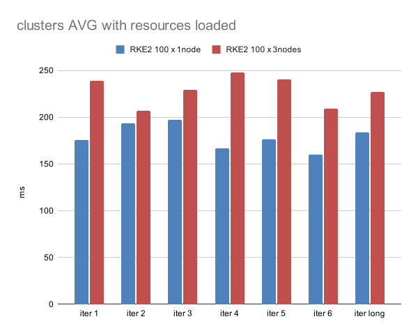
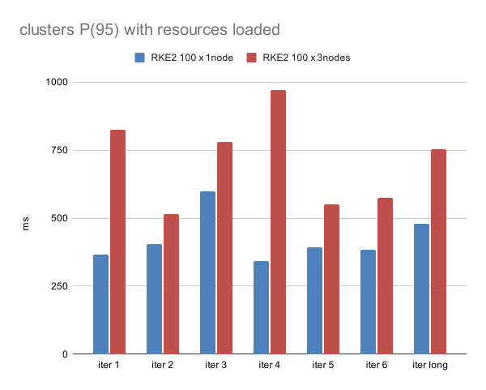

# 2023-12-01 - Performance measurements of RKE2 Rancher managing 100 downstream clusters of 1 vs 3 nodes each

This test measured resource queries to Rancher with and without extra resource loading and comparing the results between similar scenario setups: in both the scenarios Rancher manages 100 k3s clusters.
The scenarios differs in the number of nodes each one of these 100 clusters has: 1 node in the first scenario, 3 nodes in the other one.

## Results
Increasing the number of the nodes in the Rancher managed clusters impacts performance and CPU usage.
In particular:
* **~100% CPU usage increase** on "idle" (not running any user task/workload).

* **~20% expected serve time increases** in API response time (cluster resources, long iter) which raises to **50% for the P(95) serve time**.

The increased CPU usage is particularly visible when Rancher cluster is loaded with some extra resources, bringing the total CPU usage of the 3 control plane nodes running Rancher from 3 cores to 6 cores.
With a fresh Rancher + downstream clusters deployment, the load is minimal and the CPU load varies from ~0.750 to ~0.950 cores. While these numbers are not one the double of the other, consider that with so low CPU usage the base OS processes running on the nodes have an high CPU % footprint.

The increase response time is more visible when extra resources are loaded as well, in particular on longer runs and when looking at the worst results (max and P(95)).

## Hardware and infrastructure configuration outline

Scenarios provisioned on Azure Cloud:

RKE2 100 x 1 node scenario:
* Rancher cluster: 1 x
  * 3 CP Nodes: Standard_E8ads_v5 vm size (8 vCores, 64GB RAM)
  * 1 Agent Node: Standard_E8ads_v5 (dedicated to monitoring data collection)
* Downstream clusters: 100 x
  * 1 CP Node: Standard_B1ms (1 vCore, 2GB RAM)
* Tester cluster: 1 x
  * 1 CP Node: Standard_B2as_v2 (2 vCore, 8GB RAM)

RKE2 100 x 3 node scenario:
* Rancher cluster: 1 x
  * 3 CP Nodes: Standard_E8ads_v5 vm size (8 vCores, 64GB RAM)
  * 1 Agent Node: Standard_E8ads_v5 (dedicated to monitoring data collection)
* Downstream clusters: 100 x
  * 3 CP Nodes: Standard_B1ms (1 vCore, 2GB RAM)
* Tester cluster: 1 x
  * 1 CP Node: Standard_B2as_v2 (2 vCore, 8GB RAM)

## Process outline
For each of the two scenarios:
* started automated infrastructure deployment, Rancher installation and Downstream cluster import
* (1) started tests and collected results
  * 6 batches (iter #1 - #6) of 30 iterations, one longer batch of 1000 iterations (iter long)
* loaded resources on Rancher cluster:
  * 200 users.management.cattle.io
  * 200 globalroles.management.cattle.io
  * 200 globalrolebindings.management.cattle.io
  * 10000 configmaps
  * 50 projects.management.cattle.io
* (2) started tests and collected results
  * 6 batches (iter #1 - #6) of 30 iterations, one longer batch of 1000 iterations (iter long)